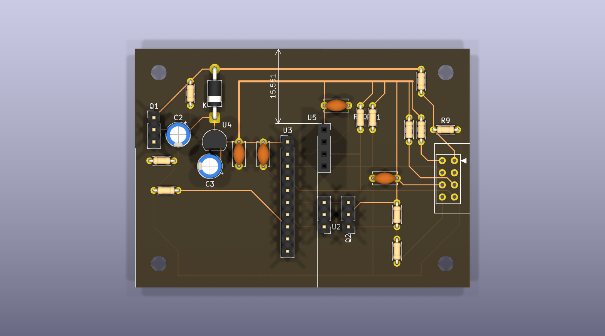
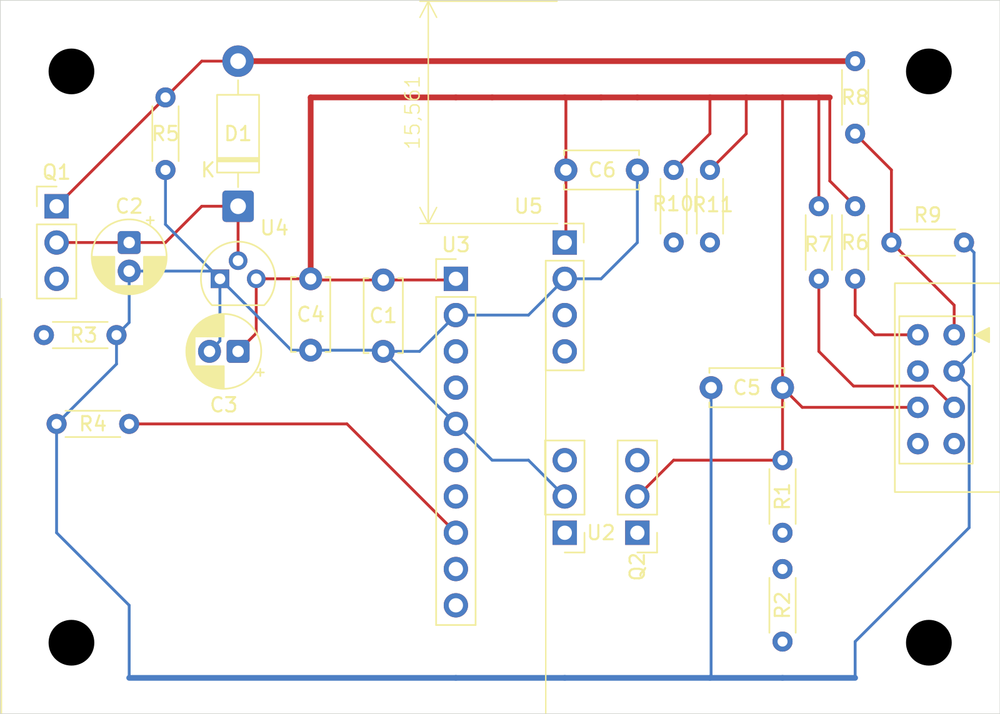
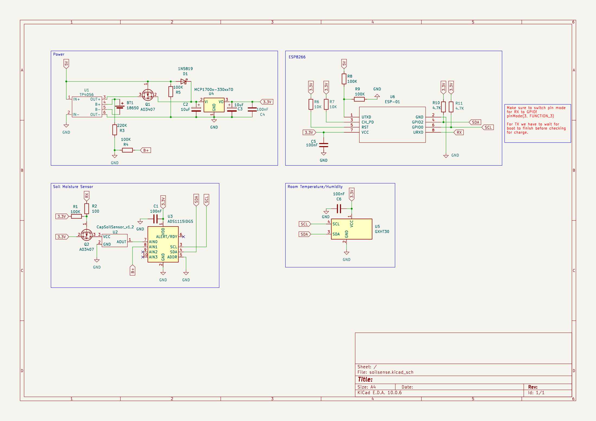
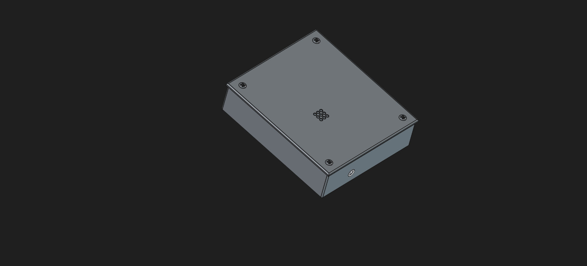

# SoilSense

A low-power soil moisture and climate sensor for your garden. It samples capacitive soil moisture, temperature, and humidity, then reports them to Home Assistant. The whole device runs on an ESP-01 and is powered by a single 18650 cell, good for roughly six months per charge. It lives in a 3D-printed enclosure you can print at home.



## Features

- Battery-operated ESP-01 that deep-sleeps between readings to stretch battery life
- Single 18650 cell, estimated six months per charge
- Capacitive soil moisture probe sampled through an ADS1115 ADC
- GXHT30 digital temperature and humidity sensor
- Publishes over MQTT and the Home Assistant API, with OTA updates
- Custom two-layer PCB with a TP4056 lithium battery charger
- 3D-printed case and lid, modeled in FreeCAD and exported as STL

## Design notes

Why an ESP-01? At the time it was the smallest board I had on hand, and that was the point. I wanted to see how little hardware could still run a useful garden sensor. An ESP32 would have made this easier; it even has ADCs onboard, but easier was not the goal.

The ESP-01 has no ADC on the module, so the probe reads through an external ADS1115 on the same I2C bus as the GXHT30. The 16-bit ADC is overkill for a moisture probe, but it keeps the analog side out of the firmware and the whole board on two wires.

Deep sleep is what makes the battery life work. Between readings the chip sleeps, so the sensor sits in the soil without a cable and without frequent recharges.

## Design

### Electronics

The schematic and PCB are designed in KiCad and live in `design/soilsense/`. The board hosts an ESP-01 module, the TP4056 charger, and an I2C bus that connects the ADS1115 and the GXHT30. While the design was being refined, several board variants were explored (30x70 mm, 50x70 mm, and one rotated ESP layout); the main board is `soilsense.kicad_pcb`.

### Firmware

The firmware is an ESPHome config, `firmware/soilsense.yaml`. It reads the sensors over I2C, publishes to Home Assistant, and puts the chip to deep sleep. WiFi credentials and API keys live in a gitignored `secrets.yaml`. Flash it with:

```
esphome run soilsense.yaml
```

### Enclosure

The case is modeled in FreeCAD (`design/enclosure.FCStd`) and exported as STL for printing (`design/enclosure-case.stl` and `design/enclosure-lid.stl`). The lid snaps over the case, and the base carries a slot for the moisture probe.

## Repository layout

```
design/
  enclosure.FCStd                  FreeCAD source of the case
  enclosure-case.stl               case, ready to print
  enclosure-lid.stl                lid, ready to print
  soilsense/                       KiCad project (schematic, PCB, board variants)
firmware/
  soilsense.yaml                   ESPHome configuration
images/
  board render, PCB layout, schematic and enclosure photos
```

## Images







